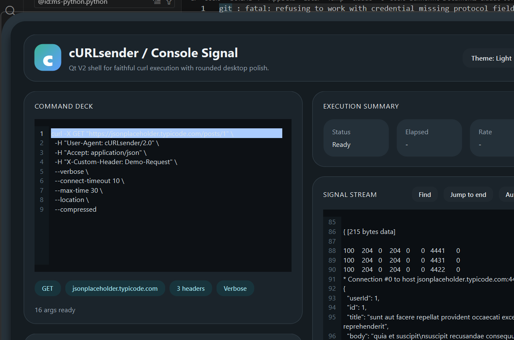
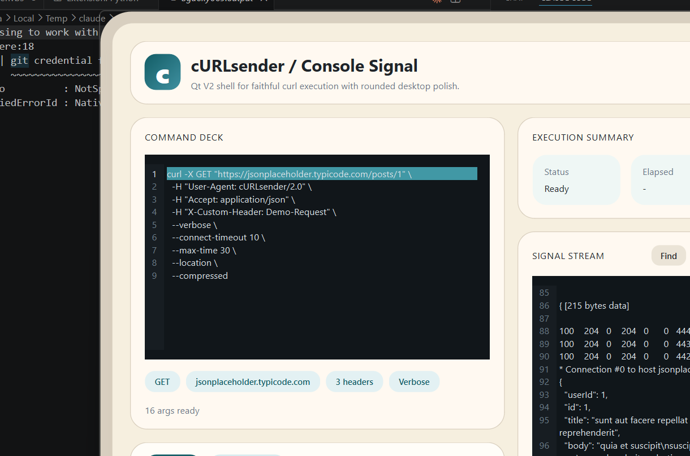

# cURLsender

  

A desktop GUI for running pasted `curl` commands and reading the response exactly as `curl` emits it.

The repository ships two desktop editions:

- **Qt V2** (`curlsender_qt.py`): the primary edition — borderless chrome, rounded cards, dark/light themes, preflight command analysis, output search, and session persistence.
- **Tk legacy** (`curlsender.py`): the previous implementation, kept as a fallback.

The product thesis: this is a faithful `curl` runner, not an API client. What `curl` prints, you see.

## Screenshots

| Dark theme | Light theme |
|:---:|:---:|
|  |  |

## Features

**Qt V2 (primary)**
- Borderless window with rounded card panels
- Dark and light themes, switchable at runtime
- Preflight analysis: method, host, header count, body/auth detection — before you run anything
- Session persistence: restores last command and output on next launch
- Output search (`Ctrl+F`) with match highlighting
- Windows one-click launcher (`.vbs`)

**Both editions**
- Runs the real `curl` binary — flags behave exactly as documented
- Accepts commands with or without a leading `curl`
- Handles `\`, `^`, and `` ` `` line continuations from any shell
- Parses bash-style quoted arguments on Windows via `shlex.split(posix=True)`
- Preserves multi-line JSON bodies inside `-d '...'` blocks
- Streams stdout + stderr as raw output
- `Ctrl+Enter` to execute, `Esc` to cancel an active run

## Dependencies

Shared runtime:

| Dependency | Version | Needed for | How to get it |
|---|---|---|---|
| Python | 3.10+ | both editions | [python.org/downloads](https://www.python.org/downloads/) |
| curl | any recent version | both editions | Bundled on Windows 10 (1803+) and Windows 11; preinstalled on most Linux/macOS |

Edition-specific:

| Dependency | Needed for | How to get it |
|---|---|---|
| `PySide6` | Qt V2 | `py -3 -m pip install -r requirements-qt.txt` |
| `tkinter` | Tk legacy | Bundled on Windows/macOS; install distro package on Linux |

### Quick verification

Run these commands in a terminal:

```bash
python --version
curl --version
python -c "import PySide6; print(PySide6.__version__)"   # Qt V2
python -m tkinter                                         # Tk legacy
```

## Installation

### 1. Get the code

```bash
git clone https://github.com/Hefero/cURLsender.git
cd cURLsender
```

Or download the ZIP and extract it anywhere.

### 2. Install what you need

**Windows**

- Install Python from [python.org](https://www.python.org/downloads/windows/).
- Check "Add python.exe to PATH" in the installer.
- `curl.exe` is already in `C:\Windows\System32` on current Windows releases.
- For the Qt V2 shell, install:

```bat
py -3 -m pip install -r requirements-qt.txt
```

**macOS**

- Install Python from [python.org](https://www.python.org/downloads/macos/) or Homebrew.
- Install Qt V2 dependency with `python3 -m pip install -r requirements-qt.txt` if you want the Qt shell.

**Linux**

- Install Python and `curl` as usual for your distro.
- Install `tkinter` separately if you want the legacy app.
- Install `PySide6` with `python3 -m pip install -r requirements-qt.txt` if you want the Qt shell.

## Running the app

### Windows

Primary launcher:

- Double-click `curlsender.vbs`

Explicit launchers:

- `curlsender-qt.vbs` starts the Qt V2 shell
- `curlsender-tk.vbs` starts the Tk legacy shell

If the Qt bootstrap says `PySide6` is missing, install it and relaunch:

```bat
py -3 -m pip install -r requirements-qt.txt
```

From a terminal:

```bat
python curlsender_qt_boot.py
python curlsender_qt.py
python curlsender.py
```

### Linux

Legacy launcher:

```bash
chmod +x curlsender.sh
./curlsender.sh
```

Directly:

```bash
python3 curlsender.py
python3 curlsender_qt.py
```

### macOS

```bash
python3 curlsender.py
python3 curlsender_qt.py
```

## Usage

1. Paste a cURL command into the command editor.
2. Press `Ctrl+Enter` or click `Execute`.
3. Read the raw output in the stream panel.
4. Click the button again while running to send a cancel request.
5. Use `Clear output` to wipe only the stream, or `Clear all` to reset the whole session.

### Example

Paste this as-is:

```bash
curl -X POST https://httpbin.org/post \
  -H 'Content-Type: application/json' \
  -d '{
    "hello": "world"
  }'
```

The line continuations collapse, the JSON newlines survive, and the request is executed as one real `curl` invocation.

## Troubleshooting

**`python` is not recognized**  
Python was not added to PATH. Re-run the installer and check "Add python.exe to PATH", or use the `py` launcher.

**`PySide6` is missing**  
Install the Qt dependency:

```bat
py -3 -m pip install -r requirements-qt.txt
```

**`ModuleNotFoundError: No module named 'tkinter'`**  
Install the Tk package for your distro if you want the legacy app.

**Output shows `'curl' not found on PATH`**  
Install `curl` or make sure it is visible on PATH.

**Parse error: No closing quotation**  
The pasted command has unbalanced quotes. Check headers, bodies, and pasted multiline blocks.

**Variables like `$TOKEN` are not expanded**  
By design. Substitute literal values before pasting.

**Huge inline bodies fail on Windows**  
Windows command lines top out at roughly 32 KB. Prefer `-d @body.json` over giant inline payloads.

## How it works

1. The pasted text is normalized so `\`, `^`, and `` ` `` line continuations collapse into spaces.
2. `shlex.split(..., posix=True)` tokenizes the result with bash-like quoting rules.
3. A leading `curl` token is stripped if present, then the app executes `curl` directly with `shell=False`.
4. Stdout and stderr are merged and streamed into the UI as raw output.

## Repository layout

| File | Purpose |
|---|---|
| `curlsender_qt.py` | Primary Qt V2 app |
| `curlsender_qt_boot.py` | Stdlib-only Qt bootstrap |
| `curlsender_qt_widgets.py` | Qt helper widgets |
| `curlsender_core.py` | Shared parsing and persistence helpers |
| `curlsender.py` | Legacy Tk app |
| `curlsender.vbs` | Primary Windows launcher for Qt V2 |
| `curlsender-qt.vbs` | Explicit Qt V2 launcher |
| `curlsender-tk.vbs` | Explicit Tk launcher |
| `curlsender.sh` | Legacy Linux launcher |
| `requirements-qt.txt` | Qt dependency list |
| `docs/mockups/index.html` | Interactive mockup gallery |

## Limitations

- Windows command-line length cap (~32 KB) — use `-d @body.json` for large payloads.
- No environment variable expansion — substitute literal values before pasting.
- No response pretty-printing, headers pane, or request history.
